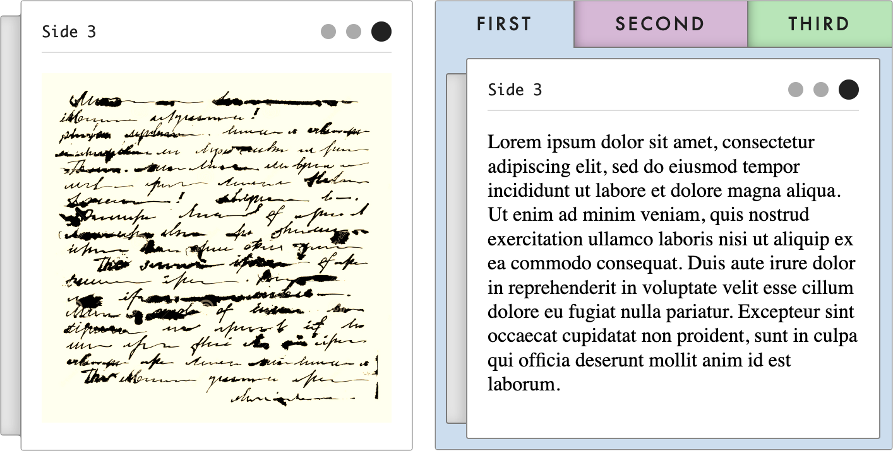

Stucco
======
The Stucco[1](#notes-name) project is an ongoing experiment in creating adaptive user interfaces on top of a generic Clojure data model. The library contains a collection of accessible [reagent](https://github.com/reagent-project/reagent) components that together constitute a toolkit for doing rapid application development in the browser.

Overview
--------

The library is still very much in the [hammock stage](https://www.youtube.com/watch?v=f84n5oFoZBc), so the API is definitely not stable. That is not to say that the software is particularly buggy, just that the names and the general organisation of the code may vary greatly between versions.

It is currently being used - together with [rescope](https://github.com/kuhumcst/rescope) - to build the [glossematics](https://github.com/kuhumcst/glossematics) archival website as part of the _"Infrastrukturalisme"_ project, a joint effort between the University of Copenhagen and Aarhus University.

### Components
Stucco components can be divided into four separate types, each given their own namespace:

* `dk.cst.stucco.document`: Document components are comparable to typical reusable components found in libraries such as [re-com](https://github.com/day8/re-com). The primary purpose of a Document component is to provide a basic level of interactivity expected for simple pieces of data. An example might be the `illustration` component which can be used in place of the HTML `[:img]` element.
* `dk.cst.stucco.group`: Group components are used to group other components in a loose manner, while allowing the user to manipulate the layout within the group.
* `dk.cst.stucco.pattern`: Implementations of common WAI-ARIA patterns. Pattern components are more complex than Document components and reflect the mutability of their underlying state. In practice, this mutability is realised as universal drag-and-drop between Document components with compatible data. An example might be the `tabs` or `carousel` components which both visualise a collection of key-value pairs according to an index.
* `dk.cst.stucco.landmark`: Landmark components are used to realise a user interface declaratively. Rather than specifying their precise locations, Stucco components are partitioned semantically into WAI-ARIA Landmark sections. These sections are then positioned on the web page according to an archetypical layout. Like the Pattern or Group components, this layout can also be changed by the end user, but at a higher level of abstraction.

The components allow you to construct a user interface that can adapt to various end user requirements without resulting in configurations that become too strange. When combined, Stucco components also compose into highly accessible web applications.[2](#notes-vision)

### CSS
Each of the four Stucco component types have an accompanying CSS file:

* `document.css` for the `dk.cst.stucco.document` namespace
* `group.css` for the `dk.cst.stucco.group` namespace
* `pattern.css` for the `dk.cst.stucco.pattern` namespace
* `landmark.css` for the `dk.cst.stucco.landmark` namespace

If _any_ component from one of the namespaces is in use, the accompanying CSS file must also be loaded on the page!

In addition, two other CSS files are _always_ required:

* `theme.css` - Contains user-defined vars used to adjust the overall look. Can be uses _as-is_ or modified.
* `shared.css` - Contains shared CSS used across different components.

The [BEM convention](http://getbem.com/) is used throughout the CSS files. In fact, some ClojureScript functionality relies directly on BEM classes. Such functionality is implemented in `dk.cst.stucco.dom.bem` and used in e.g. `dk.cst.stucco.dom.drag` to support drag-and-drop functionality.

Development
-----------
The development workflow of the library itself is built around the [Clojure CLI](https://clojure.org/reference/deps_and_cli) for managing dependencies and [shadow-cljs](https://github.com/thheller/shadow-cljs) for compiling ClojureScript code and providing a live-reloading development environment.[3](#notes-development)

Notes
-----
> <a name="notes-name">1</a> A [construction material](https://en.wikipedia.org/wiki/Stucco) used as a decorative coating for Clojure data, allowing end users to participate in sculpturing the user interface.
>
> <a name="notes-vision">2</a> Please see doc/[vision.md](doc/vision.md) for more on the reasoning behind certain design decisions.
>
> <a name="notes-development">3</a> Please see doc/[development.md](doc/development.md) for more on the development of the library itself.
